# Laporan Proyek Machine Learning - Rizky Aditya
Proyek ini dibuat sebagai bahan tugas pengerjaan proyek dalam kursus Machine Learning Terapan Dicoding
## Domain Proyek
### Latar Belakang
Kematian mendadak tanpa diketahui diagnosa penyakit sebelumnya kerap terjadi di kalangan masyarakat. Salah satu penyebab kematian mendadak adalah
Serangan Jantung. Serangan jantung disebut juga sebagai *infark miokart* adalah gangguan jantung serius ketika otot jantung tidak mendapat aliran darah. Kondisi ini akan mengganggu
Fungsi Jantung dalam mengalirkan darah ke seluruh tubuh. Penyebab utama kondisi ini adalah penyakit jantung koroner, yang terjadi ketika pembuluh darah koroner yang memasok darah
ke dalam jantung tersumbat. Penyumbatan ini terjadi ketika timbunan kolestrol yang membentuk plak di dinding pembuluh darah [1].

Serangan jantung ini dapat terjadi dimana saja dan kapan saja dan dapat berakibat fatal hingga menyebabkan kematian, Sehingga hal ini perlu diwaspadai sejak dini. Namun, situasi
yang terjadi di masyarakat saat ini, kebanyakan tidak memahami secara *detail* mengenai gejala dan hal-hal yang menyebabkan serangan jantung, sehingga masyarakat tidak mengetahui jika
mengalami serangan ini dan tidak mendapatkan penanganan yang cepat, akan berakibat fatal kepada kematian. [2] Secara teori, gejala serangan jantung yaitu rasa tidak nyaman atau nyeri didada , sesak nafas, pusing, mual, muntah, dan keringat dingin.  

Selain mengenali gejala serangan jantung, masyarakat juga perlu mengetahui faktor penyebab serangan jantung. Sehingga dengan mengetahui faktor penyebab, masyarakat dapat meminimalkan   faktor resiko terjadinya serangan jantung. Faktor penyebab yaitu semakin bertambahnya usia semakin beresiko untuk mengalami serangan jantung, dan faktor lain seperti Tingkat Kolesterol,
tekanan darah, denyut jantung, diabetes, merokok, obesitas, riwayat keluarga dan lain sebagainya [3]. Jika faktor penyebab dapat diminimalkan, maka akan mengurangi risiko kematian akibat serangan jantung di kalangan masyarakat.

Dalam mengatasi hal ini, tentunya pihak medis atau pihak dalam industri kesehatan memiliki peranan dalam mengedukasi masyarakat untuk rutin mengecek kondisi mereka dan rutin
dalam menjaga diri mereka agar tidak mengalami serangan jantung. Namun, dengan jumlah masyarakat yang cukup banyak sering kali menyulitkan pihak medis untuk memberikan perhatian dan
edukasi pada setiap individu. Oleh karena itu, dibutuhkan algoritma prediksi serangan jantung, yang diharapkan dapat memberikan dukungan tambahan bagi pihak medis dalam
mengidentifikasi potensi risiko serangan jantung pada setiap individu secara lebih efisien.

Dalam tahap awal proyek ini, fokus penelitian adalah mencari algoritma klasifikasi yang tepat dalam menentukan risiko individu berisiko terkena serangan jantung atau tidak, algoritma
ini nantinya akan mengintegrasikan berbagai data klinis dan faktor risiko yang relevan untuk memprediksi risiko serangan jantung pada individu. Diharapkan dengan algoritma ini akan
menjadi alat yang berguna bagi pihak medis dalam meningkatkan deteksi dini dalam pencegahan serangan jantung, serta meningkatkan kesadaran masyarakat tentang pentingnya menjaga
kesehatan jantung.

Algoritma prediksi dapat membantu pihak medis dalam meningkatkan deteksi dini serangan jantung dengan cara sebagai berikut:

1. **Identifikasi Risiko Individu**: Algoritma prediksi dapat mengintegrasikan data klinis dan faktor risiko yang relevan dari setiap individu, seperti usia, tingkat kolesterol, tekanan darah, riwayat keluarga, dan lain-lain. Dengan analisis ini, algoritma dapat mengidentifikasi individu yang berisiko tinggi terkena serangan jantung.

2. **Pemantauan Berkelanjutan**: Algoritma dapat digunakan untuk memantau kondisi kesehatan pasien secara terus-menerus. Dengan memantau faktor risiko dan perubahan kondisi kesehatan, pihak medis dapat mengidentifikasi perkembangan risiko serangan jantung pada setiap individu.

3. **Pengambilan Keputusan Klinis**: Berdasarkan hasil prediksi yang diberikan oleh algoritma, pihak medis dapat mengambil langkah-langkah preventif atau intervensi yang sesuai untuk mengurangi risiko serangan jantung pada pasien. Ini bisa mencakup perubahan gaya hidup, penggunaan obat-obatan, atau intervensi medis yang lebih lanjut.

4. **Edukasi Pasien**: Informasi yang dihasilkan oleh algoritma prediksi dapat digunakan untuk memberikan edukasi kepada pasien tentang faktor risiko yang mempengaruhi serangan jantung. Dengan pemahaman yang lebih baik tentang kondisi kesehatan mereka, pasien dapat mengambil langkah-langkah preventif yang tepat untuk mengurangi risiko serangan jantung.

## Business Understanding

Proyek ini diharapkan dapat memberi dampak signifikan baik bagi dunia bisnis dan dunia kesehatan. Dalam sudut pandang bisnis, diharapkan proyek ini dapat memberikan
solusi teknologi yang inovatif bagi lembaga kesehatan. Dalam sudut pandang dunia kesehatan, proyek ini dapat memiliki potensi untuk meningkatkan deteksi dini serangan jantung,
dapat membantu pihak medis dalam menentukan risiko penyakit jantung lebih cepat, sehingga dapat berpotensi mengurangi angka kematian, meningkatkan kualitas hidup pasien dan
memungkinkan intervensi medis yang lebih tepat waktu terhadap pasien berisiko terkena serangan jantung.

Solusi teknologi ini dapat diterapkan dalam lembaga kesehatan dengan cara sebagai berikut:

1. **Penerapan Algoritma Prediksi**: Algoritma prediksi diintegrasikan ke dalam sistem informasi rumah sakit atau aplikasi kesehatan. Data klinis pasien dimasukkan ke dalam algoritma untuk memprediksi risiko serangan jantung.

2. **Monitoring Pasien**: Sistem memantau kondisi kesehatan pasien secara real-time, termasuk tingkat kolesterol, tekanan darah, dan detak jantung.

3. **Peningkatan Efisiensi**: Dengan adanya algoritma prediksi dan monitoring pasien secara otomatis, efisiensi dalam deteksi dini serangan jantung meningkat.

Melalui penerapan solusi teknologi ini, lembaga kesehatan dapat meningkatkan efisiensi dalam deteksi dini serangan jantung. Tim medis dapat mengidentifikasi pasien dengan risiko tinggi secara lebih cepat dan akurat, sehingga memungkinkan intervensi medis yang tepat waktu. Hal ini tidak hanya mengurangi angka kematian akibat serangan jantung, tetapi juga meningkatkan kualitas

### Problem Statement
1. Bagaimana mengembangkan algoritma prediksi yang efektif untuk klasifikasi risiko serangan jantung pada pasien berdasarkan data klinis mereka?
2. Bagaimana implementasi algoritma prediksi dalam meningkatkan deteksi dini serangan jantung berdasarkan teknologi yang akan dibangun?

### Goals
1. Mengembangkan algoritma dengan tingkat akurasi prediksi yang cukup akurat untuk mengklasifikasi risiko serangan jantung pada pasien.
2. Mengimplementasikan algoritma prediksi dalam meningkatkan deteksi dini serangan jantung berdasarkan teknologi yang akan dibangun.

### Solution
1. Mengumpulkan data klinis pasien yang relevan dan memproses data tersebut agar bisa diolah oleh algoritma prediksi.
2. Mengembangkan model prediksi menggunakan beberapa algoritma pilian seperti *Random Forest Classifier* dan *Ada Boost Classifier*
3. Melakukan analisa terhadap kinerja masing masing model dengan metrik evaluasi seperti *Accuracy*  memilih model dengan metrik evaluasi terbaik

## Data Understanding
Dalam membangun model prediksi, proyek ini akan menggunakan data *Heart Attack Risk Prediction Dataset* yang dibuat oleh Sourav Banerjee.  
dataset ini didapatkan dari platform *Kaggle* dan dapat diakses di [link berikut ini](https://www.kaggle.com/datasets/iamsouravbanerjee/heart-attack-prediction-dataset)

Dataset dipilih berdasarkan penilaian atas jumlah fitur yang mencukupi untuk mewakili kategori-kategori yang berpotensi menjadi penyebab serangan jantung. Seleksi dataset dilakukan setelah melakukan evaluasi terhadap beberapa dataset yang tersedia di Kaggle.

Penyelidikan dataset dilakukan dengan mempertimbangkan ketersediaan fitur yang mencakup berbagai aspek yang relevan dengan risiko serangan jantung. Dataset dipilih berdasarkan kriteria ini untuk memastikan bahwa dataset yang digunakan dapat memberikan informasi yang komprehensif dan cukup untuk mengembangkan algoritma prediksi risiko serangan jantung yang efektif.

### Daftar Variabel dalam Dataset
1. **Patient ID** - Identifikasi unik untuk setiap pasien.
2. **Age** - Usia Pasien (Numerikal).
3. **Sex** - Kategori Jenis Kelamin Pasien (Kategorikal : Laki-Laki/Perempuan).
4. **Cholesterol** - Tingkat Kolesterol Pasien (Numerikal).
5. **Blood Pressure** - Tingkat tekanan darah pasien (Numerikal).
6. **Heart Rate** - Denyut jantung pasien.
7. **Diabetes** - Apakah pasien memiliki diabetes (Kategorikal : Ya/Tidak).
8. **Family History** - Riwayat Keluarga terkait masalah jantung (Kategorikal : 1 - Ya, 0 - Tidak)
9. **Smoking** - Status Perokok Pasien (Kategorikal : 1 - Ya, 0 - Tidak)
10. **Obesity** - Status Obesitas Pasien (Kategorikal : 1 - Obesitas, 0 - Tidak Obesitas)
11. **Alcohol Consumption** - Tingkat konsumsi alkohol oleh pasien (Kategorikal : None/Light/Moderate/Heavy)
12. **Exercise Hours Per Week** - Jumlah Jam Olahraga Per Minggu (Numerikal)
13. **Diet** - Kebiasaan diet pasien (Kategorikal : Healthy/Average/Unhealthy)
14. **Previous Heart Problems** - Riwayat penyakit jantung pasien sebelumnya (Kategorikal : 1 - Ya, 0 - Tidak)
15. **Medication Use** - Penggunaan obat oleh pasien (Kategorikal : 1 - Ya, 0 - Tidak)
16. **Stress Level** - Tingkat Level Stress Pasien (1-10)
17. **Sedentary Hours Per Day** - Jam aktivitas duduk per hari (Kategorikal)
18. **Income** - Tingkat pendapatan pasien (Numerikal)
19. **BMI** - Index massa tubuh pasien (Numerikal)
20. **Triglycerides** - Tingkat trgliserida Pasien
21. **Physical Activity Days Per Week** - Hari-hari aktivitas fisik per minggu.
22. **Sleep Hours Per Day** - Jam tidur per hari
23. **Country** - Negara Tempat Tinggal Pasien
24. **Continent** - Benua tempat Tinggal Pasien
25. **Hemisphere** - Belahan bumi tempat tinggal pasien
26. **Heart Attack Risk** - Variabel Target Prediksi risiko serangan jantung (Kategori 1 : Memiliki Risiko, 0 - Tidak)

**Hasil Analisa data juga ditemukan bahwa data tidak memiliki *Missing Values* dan *Duplicates*
Langkah selanjutnya adalah mengidentifikasi adanya **Outlier** atau **Pencilan** Dalam Data.
**Outliers** adalah sampel yang nilainya sangat jauh dari cakupan umum data utama, ia adalah hasil pengamatan yang
kemunculannya sangat jarang dan berbeda dari hasil pengamatan lainnya.

Dalam proyek ini, akan menggunakan Metode **IQR Method** dalam mengatasi outlier.
Metode *Inter Quartile Range* atau IQR berhubungan dengan konsep kuartil. Kuartil dari suatu populasi adalah
tiga nilai yang membagi distribusi data menjadi empat sebaran. Seperempat dari data berada pada kuartil pertama (Q1),
setengah dari data berada dibawah kuartil kedua (Q2), dan tiga perempat dari data berada di kuartil ketiga (Q3).

Nilai Interquartile Range didapatkan dengan rumus

IQR = Q3 - Q1

Berikut adalah visualisasi dengan *Boxplot* untuk mendeteksi *outliers* pada kolom numerikal.

**Fitur *age***
    
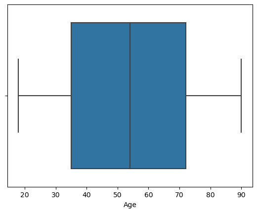
    

Dalam *Boxplot* diatas, tidak ditemukan *Outliers* pada kolom numerik *Age*

**Fitur *Cholesterol***

    
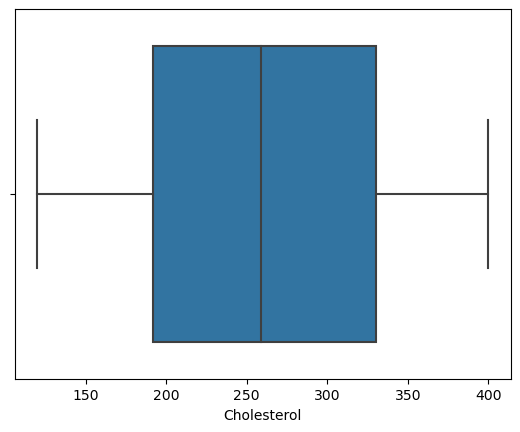
    

Dalam *Boxplot* diatas, tidak ditemukan Outliers pada kolom numerik *Cholesterol*

Identifikasi *Outliers* dapat lebih cepat dilakukan apabila memanfaatkan *For Loop* untuk membuat visualisasi boxplot sekaligus kepada seluruh kolom numerikal dalam dataset
    
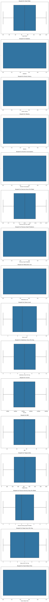
    

Hasil analisa juga menunjukkan jika dataset yang ada tidak memiliki *Outliers* untuk kolom numerikalnya

Tahap berikutnya adalah mengetahui *Shape* dari dataset yang digunakan.
Dataset yang digunakan memiliki 8763 baris data dengan 26 fitur.

Tahapan selanjutnya yang dilakukan adalah tahapan **Univariate Analysis** dan **Multivariate Analysis**.

### Univariate Analysis
Tahapan ini merupakan tahapan menganalisa satu persatu fitur kategorikal dan numerikal dalam dataset.

### Analisis Fitur Kategorikal

**Fitur Jenis Kelamin (*Sex*)**

Berikut adalah pengecekan distribusi data berdasarkan jenis kelamin.

            jumlah sampel  persentase
    Sex                              
    Male             6111        69.7
    Female           2652        30.3
    

    
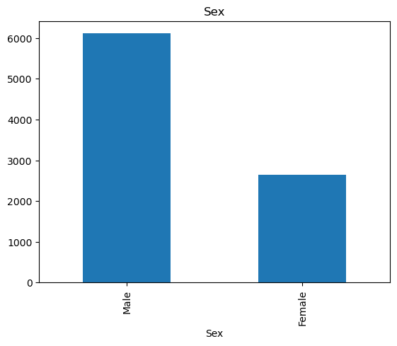
    

Distribusi data diatas menunjukkan bahwa lebih banyak data pasien pria ketimbang wanita didalam dataset

**Fitur Diabetes**

Berikut adalah pengecekan distribusi data berdasarkan kategori diabetes

              jumlah sampel  persentase
    Diabetes                           
    1                  5716        65.2
    0                  3047        34.8
    

    
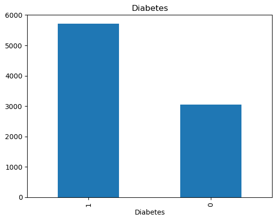
    

Visualisasi diatas menunjukkan bahwa kebanyakan pasien dalam data mengalami diabetes (65,2%), sedangkan sisanya tidak mengalami diabetes

**Fitur *Family History***

Berikut adalah hasil pengecekan untuk *Family History*

                    jumlah sampel  persentase
    Family History                           
    0                        4443        50.7
    1                        4320        49.3
    

    
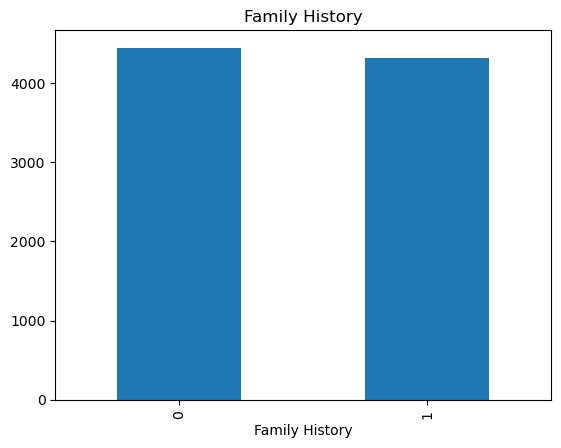
    

Dalam distribusi diatas terlihat terhadap jumlah yang hampir seimbang antara pasien yang memiliki riwayat keluarga terkena penyakit jantung, dan yang tidak

**Fitur *Smoking***

             jumlah sampel  persentase
    Smoking                           
    1                 7859        89.7
    0                  904        10.3
    

    
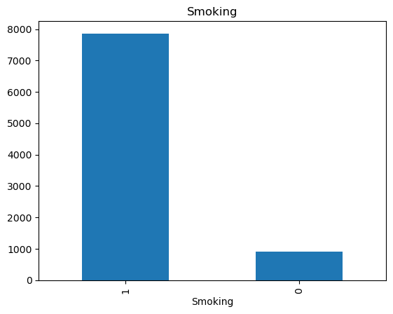
    

Dari visualisasi data diatas dapat dilihat, sebagian besar data pasien merupakan perokok (Sekitar 89 Persen) sedangkan sisanya adalah bukan perokok

**Fitur *Obesity***

Berikut adalah pengecekkan sebaran data berdasarkan pasien mengalami Obesitas atau Tidak

             jumlah sampel  persentase
    Obesity                           
    1                 4394        50.1
    0                 4369        49.9
    

    
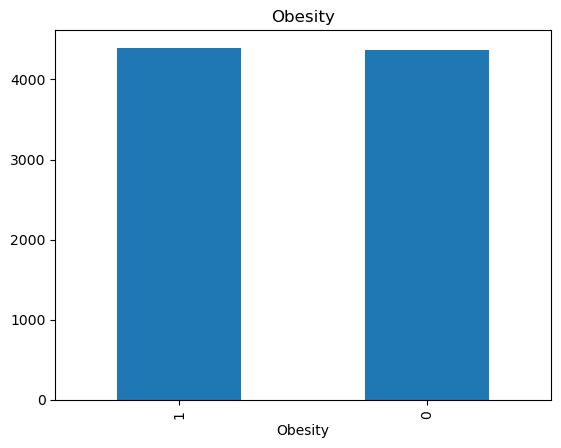
    

Dalam distribusi diatas terlihat terhadap jumlah yang hampir seimbang antara pasien mengalami obesitas atau tidak

**Fitur *Alcohol Consumption***

Selanjutnya akan dicek penyebaran data berdasarkan tingkat konsumsi alkohol pasien

                         jumlah sampel  persentase
    Alcohol Consumption                           
    1                             5241        59.8
    0                             3522        40.2
    

    
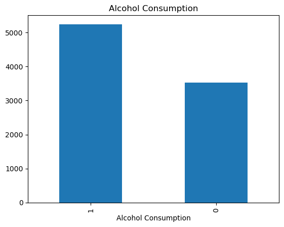
    

Dalam visualisasi diatas, dapat disimpulkan bahwa terdapat hampir lebih dari setengah data pasien pernah mengkonsumsi alkohol, sedangkan sisanya tidak

**Fitur *Diet***

Berikut adalah analisa untuk melihat sebaran data pasien berdasarkan kebiasaan diet mereka

               jumlah sampel  persentase
    Diet                                
    Healthy             2960        33.8
    Average             2912        33.2
    Unhealthy           2891        33.0
    

    
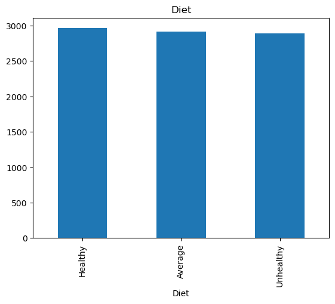
    

Terlihat dalam visualisasi data diatas, terdapat distribusi yang cukup seimbang antara pasien dengan kebiasaan diet *Healthy*, Kebiasan Diet *Average*, dan *Unhealthy*

**Fitur *Previous Heart Problems***

Berikut adalah pengecekkan sebaran data berdasarkan riwayat mereka mengalami penyakit jantung sebelumnya

                             jumlah sampel  persentase
    Previous Heart Problems                           
    0                                 4418        50.4
    1                                 4345        49.6
    

    
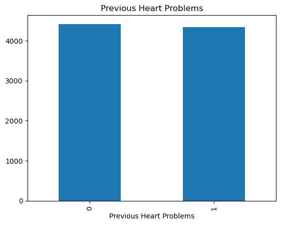
    

Dalam data diatas, sekitar 49,6 Persen pasien memiliki riwayat penyakit jantung sebelumnya, sedangkan sisanya belum pernah mengalami

**Fitur *Medication Use***

Berikut adalah pengecekan distribusi data berdasarkan pasien sedang dalam penggunaan obat atau tidak

                    jumlah sampel  persentase
    Medication Use                           
    0                        4396        50.2
    1                        4367        49.8
    

    
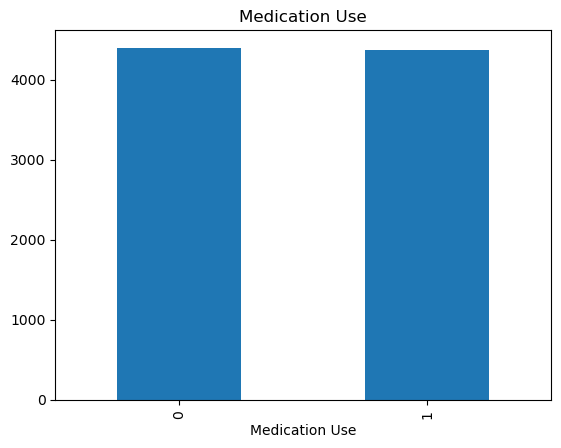
    

Dalam data diatas, sekitar 49,8 Persen pasien memiliki riwayat penyakit jantung sebelumnya, sedangkan sisanya belum pernah mengalami

**Fitur *Stress Level***

Berikut adalah sebaran data berdasarkan level stress pasien

                  jumlah sampel  persentase
    Stress Level                           
    2                       913        10.4
    4                       910        10.4
    7                       903        10.3
    9                       887        10.1
    8                       879        10.0
    3                       868         9.9
    1                       865         9.9
    5                       860         9.8
    6                       855         9.8
    10                      823         9.4
    
    
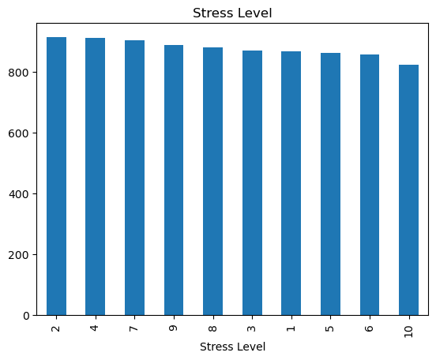
    

Diketahui terdapat distribusi data yang cukup seimbang antara masing masing level stress pasien (Skala 1-10)

## Data Preparation
### Menghapus Kolom Yang Tidak Digunakan

Beberapa kolom dalam dataset tidak akan digunakan dalam proses membangun Algoritma Prediksi, hal tersebut dikarenakan kolom terkait tidak relevan terhadap proses analisis, Kolom Tersebut adalah Kolom **Patient ID**, **Country**, **Continent**, dan **Hemisphere**

<table border="1" class="dataframe">
  <thead>
    <tr style="text-align: right;">
      <th></th>
      <th>Age</th>
      <th>Sex</th>
      <th>Cholesterol</th>
      <th>Blood Pressure</th>
      <th>Heart Rate</th>
      <th>Diabetes</th>
      <th>Family History</th>
      <th>Smoking</th>
      <th>Obesity</th>
      <th>Alcohol Consumption</th>
      <th>...</th>
      <th>Previous Heart Problems</th>
      <th>Medication Use</th>
      <th>Stress Level</th>
      <th>Sedentary Hours Per Day</th>
      <th>Income</th>
      <th>BMI</th>
      <th>Triglycerides</th>
      <th>Physical Activity Days Per Week</th>
      <th>Sleep Hours Per Day</th>
      <th>Heart Attack Risk</th>
    </tr>
  </thead>
  <tbody>
    <tr>
      <th>0</th>
      <td>67</td>
      <td>Male</td>
      <td>208</td>
      <td>158/88</td>
      <td>72</td>
      <td>0</td>
      <td>0</td>
      <td>1</td>
      <td>0</td>
      <td>0</td>
      <td>...</td>
      <td>0</td>
      <td>0</td>
      <td>9</td>
      <td>6.615001</td>
      <td>261404</td>
      <td>31.251233</td>
      <td>286</td>
      <td>0</td>
      <td>6</td>
      <td>0</td>
    </tr>
    <tr>
      <th>1</th>
      <td>21</td>
      <td>Male</td>
      <td>389</td>
      <td>165/93</td>
      <td>98</td>
      <td>1</td>
      <td>1</td>
      <td>1</td>
      <td>1</td>
      <td>1</td>
      <td>...</td>
      <td>1</td>
      <td>0</td>
      <td>1</td>
      <td>4.963459</td>
      <td>285768</td>
      <td>27.194973</td>
      <td>235</td>
      <td>1</td>
      <td>7</td>
      <td>0</td>
    </tr>
    <tr>
      <th>2</th>
      <td>21</td>
      <td>Female</td>
      <td>324</td>
      <td>174/99</td>
      <td>72</td>
      <td>1</td>
      <td>0</td>
      <td>0</td>
      <td>0</td>
      <td>0</td>
      <td>...</td>
      <td>1</td>
      <td>1</td>
      <td>9</td>
      <td>9.463426</td>
      <td>235282</td>
      <td>28.176571</td>
      <td>587</td>
      <td>4</td>
      <td>4</td>
      <td>0</td>
    </tr>
    <tr>
      <th>3</th>
      <td>84</td>
      <td>Male</td>
      <td>383</td>
      <td>163/100</td>
      <td>73</td>
      <td>1</td>
      <td>1</td>
      <td>1</td>
      <td>0</td>
      <td>1</td>
      <td>...</td>
      <td>1</td>
      <td>0</td>
      <td>9</td>
      <td>7.648981</td>
      <td>125640</td>
      <td>36.464704</td>
      <td>378</td>
      <td>3</td>
      <td>4</td>
      <td>0</td>
    </tr>
    <tr>
      <th>4</th>
      <td>66</td>
      <td>Male</td>
      <td>318</td>
      <td>91/88</td>
      <td>93</td>
      <td>1</td>
      <td>1</td>
      <td>1</td>
      <td>1</td>
      <td>0</td>
      <td>...</td>
      <td>1</td>
      <td>0</td>
      <td>6</td>
      <td>1.514821</td>
      <td>160555</td>
      <td>21.809144</td>
      <td>231</td>
      <td>1</td>
      <td>5</td>
      <td>0</td>
    </tr>
  </tbody>
</table>

5 rows × 22 columns

Dataset sudah menghapus beberapa kolom yang tidak dibutuhkan, dan siap untuk dilanjutkan ke proses berikutnya

### Memisahkan Data *Blood Pressure*

Jika diperhatikan dalam dataset, fitur *Blood Pressure* Masih dalam bentuk Object yang tentunya belum dapat digunakan dalam prediksi machine learning, proses berikutnya adalah memisahkan kolom *Blood Pressure*.  
Nilai dalam *Blood Pressure* sendiri ditulis dalam format *Systolic/Diastolic*
yang mana *Systolic* adalah tekanan darah pada saat jantung memompa darah atau saat berkontraksi, sedangkan *diastolic* adalah tekanan darah pada saat jantung relaksasi

Selanjutnya, cek data kembali, akan ada penambahan kolom baru yaitu BP_Systolic dan BP_Diastolic

    <class 'pandas.core.frame.DataFrame'>
    RangeIndex: 8763 entries, 0 to 8762
    Data columns (total 24 columns):
     #   Column                           Non-Null Count  Dtype  
    ---  ------                           --------------  -----  
     0   Age                              8763 non-null   int64  
     1   Sex                              8763 non-null   object 
     2   Cholesterol                      8763 non-null   int64  
     3   Blood Pressure                   8763 non-null   object 
     4   Heart Rate                       8763 non-null   int64  
     5   Diabetes                         8763 non-null   int64  
     6   Family History                   8763 non-null   int64  
     7   Smoking                          8763 non-null   int64  
     8   Obesity                          8763 non-null   int64  
     9   Alcohol Consumption              8763 non-null   int64  
     10  Exercise Hours Per Week          8763 non-null   float64
     11  Diet                             8763 non-null   object 
     12  Previous Heart Problems          8763 non-null   int64  
     13  Medication Use                   8763 non-null   int64  
     14  Stress Level                     8763 non-null   int64  
     15  Sedentary Hours Per Day          8763 non-null   float64
     16  Income                           8763 non-null   int64  
     17  BMI                              8763 non-null   float64
     18  Triglycerides                    8763 non-null   int64  
     19  Physical Activity Days Per Week  8763 non-null   int64  
     20  Sleep Hours Per Day              8763 non-null   int64  
     21  Heart Attack Risk                8763 non-null   int64  
     22  BP_Systolic                      8763 non-null   object 
     23  BP_Diastolic                     8763 non-null   object 
    dtypes: float64(3), int64(16), object(5)
    memory usage: 1.6+ MB
    

Dengan sudah adanya dua kolom baru tersebut, maka perlu untuk menghapus kolom *Blood Pressure* sebelumnya karena tidak digunakan lagi

 
<table border="1" class="dataframe">
  <thead>
    <tr style="text-align: right;">
      <th></th>
      <th>Age</th>
      <th>Sex</th>
      <th>Cholesterol</th>
      <th>Heart Rate</th>
      <th>Diabetes</th>
      <th>Family History</th>
      <th>Smoking</th>
      <th>Obesity</th>
      <th>Alcohol Consumption</th>
      <th>Exercise Hours Per Week</th>
      <th>...</th>
      <th>Stress Level</th>
      <th>Sedentary Hours Per Day</th>
      <th>Income</th>
      <th>BMI</th>
      <th>Triglycerides</th>
      <th>Physical Activity Days Per Week</th>
      <th>Sleep Hours Per Day</th>
      <th>Heart Attack Risk</th>
      <th>BP_Systolic</th>
      <th>BP_Diastolic</th>
    </tr>
  </thead>
  <tbody>
    <tr>
      <th>0</th>
      <td>67</td>
      <td>Male</td>
      <td>208</td>
      <td>72</td>
      <td>0</td>
      <td>0</td>
      <td>1</td>
      <td>0</td>
      <td>0</td>
      <td>4.168189</td>
      <td>...</td>
      <td>9</td>
      <td>6.615001</td>
      <td>261404</td>
      <td>31.251233</td>
      <td>286</td>
      <td>0</td>
      <td>6</td>
      <td>0</td>
      <td>158</td>
      <td>88</td>
    </tr>
    <tr>
      <th>1</th>
      <td>21</td>
      <td>Male</td>
      <td>389</td>
      <td>98</td>
      <td>1</td>
      <td>1</td>
      <td>1</td>
      <td>1</td>
      <td>1</td>
      <td>1.813242</td>
      <td>...</td>
      <td>1</td>
      <td>4.963459</td>
      <td>285768</td>
      <td>27.194973</td>
      <td>235</td>
      <td>1</td>
      <td>7</td>
      <td>0</td>
      <td>165</td>
      <td>93</td>
    </tr>
    <tr>
      <th>2</th>
      <td>21</td>
      <td>Female</td>
      <td>324</td>
      <td>72</td>
      <td>1</td>
      <td>0</td>
      <td>0</td>
      <td>0</td>
      <td>0</td>
      <td>2.078353</td>
      <td>...</td>
      <td>9</td>
      <td>9.463426</td>
      <td>235282</td>
      <td>28.176571</td>
      <td>587</td>
      <td>4</td>
      <td>4</td>
      <td>0</td>
      <td>174</td>
      <td>99</td>
    </tr>
    <tr>
      <th>3</th>
      <td>84</td>
      <td>Male</td>
      <td>383</td>
      <td>73</td>
      <td>1</td>
      <td>1</td>
      <td>1</td>
      <td>0</td>
      <td>1</td>
      <td>9.828130</td>
      <td>...</td>
      <td>9</td>
      <td>7.648981</td>
      <td>125640</td>
      <td>36.464704</td>
      <td>378</td>
      <td>3</td>
      <td>4</td>
      <td>0</td>
      <td>163</td>
      <td>100</td>
    </tr>
    <tr>
      <th>4</th>
      <td>66</td>
      <td>Male</td>
      <td>318</td>
      <td>93</td>
      <td>1</td>
      <td>1</td>
      <td>1</td>
      <td>1</td>
      <td>0</td>
      <td>5.804299</td>
      <td>...</td>
      <td>6</td>
      <td>1.514821</td>
      <td>160555</td>
      <td>21.809144</td>
      <td>231</td>
      <td>1</td>
      <td>5</td>
      <td>0</td>
      <td>91</td>
      <td>88</td>
    </tr>
  </tbody>
</table>

5 rows × 23 columns

Jika diperhatikan, dua kolom terbaru BP_Systolic dan BP_Diatolic masih memiliki tipe data object, tipe data ini harus dikonversikan ke int64 agar bisa diproses dalam algoritma prediksi

### Proses Label Encoder

Label Encoder adalah teknik pemrosesan data untuk data kategorikal, Tujuannya adalah untuk mengubah nilai-nilai dalam satu atau lebih pada kolom kategorikal menjadi numerik.

Sebelum memulai, mari identifikasi kembali kolom dari dataset yang masih memiliki tipe data object

    <class 'pandas.core.frame.DataFrame'>
    RangeIndex: 8763 entries, 0 to 8762
    Data columns (total 23 columns):
     #   Column                           Non-Null Count  Dtype  
    ---  ------                           --------------  -----  
     0   Age                              8763 non-null   int64  
     1   Sex                              8763 non-null   object 
     2   Cholesterol                      8763 non-null   int64  
     3   Heart Rate                       8763 non-null   int64  
     4   Diabetes                         8763 non-null   int64  
     5   Family History                   8763 non-null   int64  
     6   Smoking                          8763 non-null   int64  
     7   Obesity                          8763 non-null   int64  
     8   Alcohol Consumption              8763 non-null   int64  
     9   Exercise Hours Per Week          8763 non-null   float64
     10  Diet                             8763 non-null   object 
     11  Previous Heart Problems          8763 non-null   int64  
     12  Medication Use                   8763 non-null   int64  
     13  Stress Level                     8763 non-null   int64  
     14  Sedentary Hours Per Day          8763 non-null   float64
     15  Income                           8763 non-null   int64  
     16  BMI                              8763 non-null   float64
     17  Triglycerides                    8763 non-null   int64  
     18  Physical Activity Days Per Week  8763 non-null   int64  
     19  Sleep Hours Per Day              8763 non-null   int64  
     20  Heart Attack Risk                8763 non-null   int64  
     21  BP_Systolic                      8763 non-null   int64  
     22  BP_Diastolic                     8763 non-null   int64  
    dtypes: float64(3), int64(18), object(2)
    memory usage: 1.5+ MB
    

Terdapat 2 Kolom yang memiliki tipe data object yang akan di *label encoder* sehingga menjadi bentuk numerik, proses tersebut akan dilakukan menggunakan kode dibawah ini

 
<table border="1" class="dataframe">
  <thead>
    <tr style="text-align: right;">
      <th></th>
      <th>Age</th>
      <th>Sex</th>
      <th>Cholesterol</th>
      <th>Heart Rate</th>
      <th>Diabetes</th>
      <th>Family History</th>
      <th>Smoking</th>
      <th>Obesity</th>
      <th>Alcohol Consumption</th>
      <th>Exercise Hours Per Week</th>
      <th>...</th>
      <th>Stress Level</th>
      <th>Sedentary Hours Per Day</th>
      <th>Income</th>
      <th>BMI</th>
      <th>Triglycerides</th>
      <th>Physical Activity Days Per Week</th>
      <th>Sleep Hours Per Day</th>
      <th>Heart Attack Risk</th>
      <th>BP_Systolic</th>
      <th>BP_Diastolic</th>
    </tr>
  </thead>
  <tbody>
    <tr>
      <th>0</th>
      <td>67</td>
      <td>1</td>
      <td>208</td>
      <td>72</td>
      <td>0</td>
      <td>0</td>
      <td>1</td>
      <td>0</td>
      <td>0</td>
      <td>4.168189</td>
      <td>...</td>
      <td>9</td>
      <td>6.615001</td>
      <td>261404</td>
      <td>31.251233</td>
      <td>286</td>
      <td>0</td>
      <td>6</td>
      <td>0</td>
      <td>158</td>
      <td>88</td>
    </tr>
    <tr>
      <th>1</th>
      <td>21</td>
      <td>1</td>
      <td>389</td>
      <td>98</td>
      <td>1</td>
      <td>1</td>
      <td>1</td>
      <td>1</td>
      <td>1</td>
      <td>1.813242</td>
      <td>...</td>
      <td>1</td>
      <td>4.963459</td>
      <td>285768</td>
      <td>27.194973</td>
      <td>235</td>
      <td>1</td>
      <td>7</td>
      <td>0</td>
      <td>165</td>
      <td>93</td>
    </tr>
    <tr>
      <th>2</th>
      <td>21</td>
      <td>0</td>
      <td>324</td>
      <td>72</td>
      <td>1</td>
      <td>0</td>
      <td>0</td>
      <td>0</td>
      <td>0</td>
      <td>2.078353</td>
      <td>...</td>
      <td>9</td>
      <td>9.463426</td>
      <td>235282</td>
      <td>28.176571</td>
      <td>587</td>
      <td>4</td>
      <td>4</td>
      <td>0</td>
      <td>174</td>
      <td>99</td>
    </tr>
    <tr>
      <th>3</th>
      <td>84</td>
      <td>1</td>
      <td>383</td>
      <td>73</td>
      <td>1</td>
      <td>1</td>
      <td>1</td>
      <td>0</td>
      <td>1</td>
      <td>9.828130</td>
      <td>...</td>
      <td>9</td>
      <td>7.648981</td>
      <td>125640</td>
      <td>36.464704</td>
      <td>378</td>
      <td>3</td>
      <td>4</td>
      <td>0</td>
      <td>163</td>
      <td>100</td>
    </tr>
    <tr>
      <th>4</th>
      <td>66</td>
      <td>1</td>
      <td>318</td>
      <td>93</td>
      <td>1</td>
      <td>1</td>
      <td>1</td>
      <td>1</td>
      <td>0</td>
      <td>5.804299</td>
      <td>...</td>
      <td>6</td>
      <td>1.514821</td>
      <td>160555</td>
      <td>21.809144</td>
      <td>231</td>
      <td>1</td>
      <td>5</td>
      <td>0</td>
      <td>91</td>
      <td>88</td>
    </tr>
    <tr>
      <th>...</th>
      <td>...</td>
      <td>...</td>
      <td>...</td>
      <td>...</td>
      <td>...</td>
      <td>...</td>
      <td>...</td>
      <td>...</td>
      <td>...</td>
      <td>...</td>
      <td>...</td>
      <td>...</td>
      <td>...</td>
      <td>...</td>
      <td>...</td>
      <td>...</td>
      <td>...</td>
      <td>...</td>
      <td>...</td>
      <td>...</td>
      <td>...</td>
    </tr>
    <tr>
      <th>8758</th>
      <td>60</td>
      <td>1</td>
      <td>121</td>
      <td>61</td>
      <td>1</td>
      <td>1</td>
      <td>1</td>
      <td>0</td>
      <td>1</td>
      <td>7.917342</td>
      <td>...</td>
      <td>8</td>
      <td>10.806373</td>
      <td>235420</td>
      <td>19.655895</td>
      <td>67</td>
      <td>7</td>
      <td>7</td>
      <td>0</td>
      <td>94</td>
      <td>76</td>
    </tr>
    <tr>
      <th>8759</th>
      <td>28</td>
      <td>0</td>
      <td>120</td>
      <td>73</td>
      <td>1</td>
      <td>0</td>
      <td>0</td>
      <td>1</td>
      <td>0</td>
      <td>16.558426</td>
      <td>...</td>
      <td>8</td>
      <td>3.833038</td>
      <td>217881</td>
      <td>23.993866</td>
      <td>617</td>
      <td>4</td>
      <td>9</td>
      <td>0</td>
      <td>157</td>
      <td>102</td>
    </tr>
    <tr>
      <th>8760</th>
      <td>47</td>
      <td>1</td>
      <td>250</td>
      <td>105</td>
      <td>0</td>
      <td>1</td>
      <td>1</td>
      <td>1</td>
      <td>1</td>
      <td>3.148438</td>
      <td>...</td>
      <td>5</td>
      <td>2.375214</td>
      <td>36998</td>
      <td>35.406146</td>
      <td>527</td>
      <td>4</td>
      <td>4</td>
      <td>1</td>
      <td>161</td>
      <td>75</td>
    </tr>
    <tr>
      <th>8761</th>
      <td>36</td>
      <td>1</td>
      <td>178</td>
      <td>60</td>
      <td>1</td>
      <td>0</td>
      <td>1</td>
      <td>0</td>
      <td>0</td>
      <td>3.789950</td>
      <td>...</td>
      <td>5</td>
      <td>0.029104</td>
      <td>209943</td>
      <td>27.294020</td>
      <td>114</td>
      <td>2</td>
      <td>8</td>
      <td>0</td>
      <td>119</td>
      <td>67</td>
    </tr>
    <tr>
      <th>8762</th>
      <td>25</td>
      <td>0</td>
      <td>356</td>
      <td>75</td>
      <td>1</td>
      <td>1</td>
      <td>0</td>
      <td>0</td>
      <td>1</td>
      <td>18.081748</td>
      <td>...</td>
      <td>8</td>
      <td>9.005234</td>
      <td>247338</td>
      <td>32.914151</td>
      <td>180</td>
      <td>7</td>
      <td>4</td>
      <td>1</td>
      <td>138</td>
      <td>67</td>
    </tr>
  </tbody>
</table>

8763 rows × 23 columns

    <class 'pandas.core.frame.DataFrame'>
    RangeIndex: 8763 entries, 0 to 8762
    Data columns (total 23 columns):
     #   Column                           Non-Null Count  Dtype  
    ---  ------                           --------------  -----  
     0   Age                              8763 non-null   int64  
     1   Sex                              8763 non-null   int32  
     2   Cholesterol                      8763 non-null   int64  
     3   Heart Rate                       8763 non-null   int64  
     4   Diabetes                         8763 non-null   int64  
     5   Family History                   8763 non-null   int64  
     6   Smoking                          8763 non-null   int64  
     7   Obesity                          8763 non-null   int64  
     8   Alcohol Consumption              8763 non-null   int64  
     9   Exercise Hours Per Week          8763 non-null   float64
     10  Diet                             8763 non-null   int32  
     11  Previous Heart Problems          8763 non-null   int64  
     12  Medication Use                   8763 non-null   int64  
     13  Stress Level                     8763 non-null   int64  
     14  Sedentary Hours Per Day          8763 non-null   float64
     15  Income                           8763 non-null   int64  
     16  BMI                              8763 non-null   float64
     17  Triglycerides                    8763 non-null   int64  
     18  Physical Activity Days Per Week  8763 non-null   int64  
     19  Sleep Hours Per Day              8763 non-null   int64  
     20  Heart Attack Risk                8763 non-null   int64  
     21  BP_Systolic                      8763 non-null   int64  
     22  BP_Diastolic                     8763 non-null   int64  
    dtypes: float64(3), int32(2), int64(18)
    memory usage: 1.5 MB
    

Dataset siap diproses ke Langkah Selanjutnya, namun, saatnya mengecek korelasi antar data sehingga dapat mengetahui faktor apa saja dalam dataset yang paling berpengaruh pada kondisi seseorang terkena serangan jantung

    
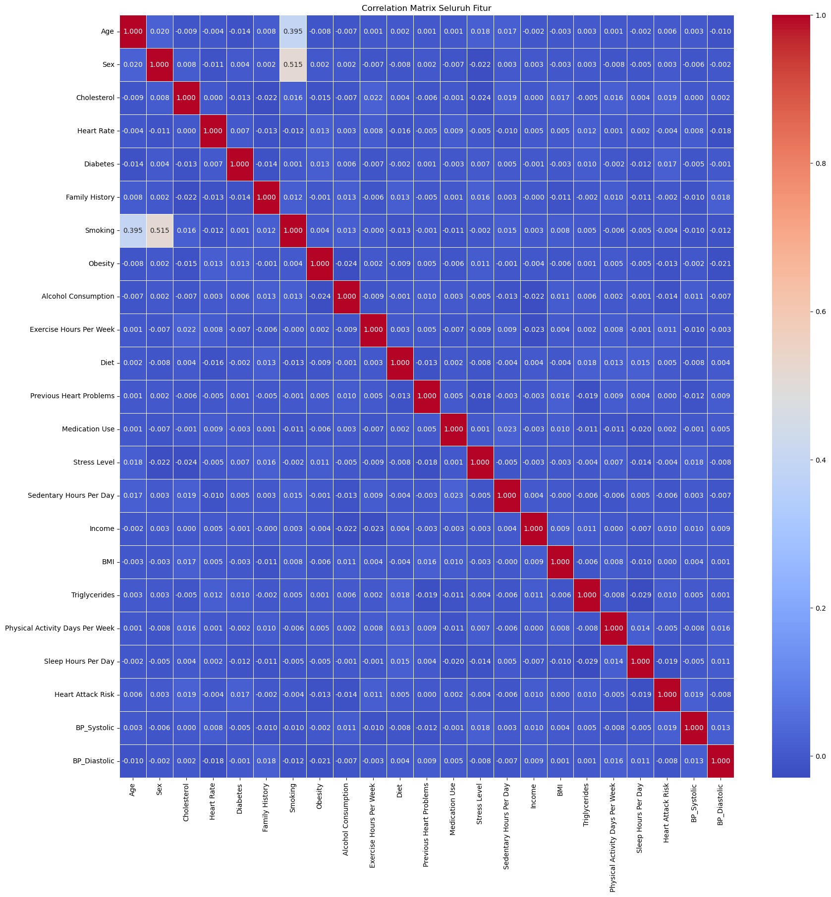
    

Diketahui bahwa fitur yang berkorelasi tinggi dengan target variabel serangat jantung adalah ***Cholesterol***, ***Diabetes***, ***Exercise Hour Per Week***

### *Train Test Split* ###

Proses ini membagi data menjadi data latih dan data uji. Data latih akan digunakan untuk membangun model, sedangkan data uji akan digunakan untuk menguji hasil performa prediksi model.

Langkah pertama dimulai dengan membagi Dataset menjadi fitur X (Fitur Independen) dan fitur Y (Fitur Y atau fitur target).
Lalu proses dilanjutkan dengan membagi data menjadi data latih dan data uji

Berikutnya adalah melihat jumlah Data Latih dan Data Uji

    Total of sample in whole dataset: 8763
    Total of sample in train dataset: 7010
    Total of sample in test dataset: 1753
    

Terdapat 7010 baris data yang akan digunakan di data latih, dan 1753 data digunakan dalam data uji

### Proses Standardisasi

Standardisasi adalah teknik transformasi yang paling umum digunakan dalam tahap persiapan pemodelan.  
Algoritma machine learning memiliki performa lebih baik dan konvergen lebih cepat ketika dimodelkan pada data dengan skala relatif sama atau mendekati distribusi normal. Proses scaling dan standarisasi membantu untuk membuat fitur data menjadi bentuk yang lebih mudah diolah oleh algoritma.
Untuk mengatasi kebocoran data, Standardisasi akan dilakukan di Data latih terlebih dahulu

StandardScaler melakukan proses standarisasi fitur dengan mengurangkan mean (nilai rata-rata) kemudian membaginya dengan standar deviasi untuk menggeser distribusi.  StandardScaler menghasilkan distribusi dengan standar deviasi sama dengan 1 dan mean sama dengan 0.  
Sebelum melakukan standardisasi, gunakan describe(), untuk melihat kolom data yang perlu dilakukan standardisasi

 
<table border="1" class="dataframe">
  <thead>
    <tr style="text-align: right;">
      <th></th>
      <th>count</th>
      <th>mean</th>
      <th>std</th>
      <th>min</th>
      <th>25%</th>
      <th>50%</th>
      <th>75%</th>
      <th>max</th>
    </tr>
  </thead>
  <tbody>
    <tr>
      <th>Age</th>
      <td>8763.0</td>
      <td>53.707977</td>
      <td>21.249509</td>
      <td>18.000000</td>
      <td>35.000000</td>
      <td>54.000000</td>
      <td>72.000000</td>
      <td>90.000000</td>
    </tr>
    <tr>
      <th>Sex</th>
      <td>8763.0</td>
      <td>0.697364</td>
      <td>0.459425</td>
      <td>0.000000</td>
      <td>0.000000</td>
      <td>1.000000</td>
      <td>1.000000</td>
      <td>1.000000</td>
    </tr>
    <tr>
      <th>Cholesterol</th>
      <td>8763.0</td>
      <td>259.877211</td>
      <td>80.863276</td>
      <td>120.000000</td>
      <td>192.000000</td>
      <td>259.000000</td>
      <td>330.000000</td>
      <td>400.000000</td>
    </tr>
    <tr>
      <th>Heart Rate</th>
      <td>8763.0</td>
      <td>75.021682</td>
      <td>20.550948</td>
      <td>40.000000</td>
      <td>57.000000</td>
      <td>75.000000</td>
      <td>93.000000</td>
      <td>110.000000</td>
    </tr>
    <tr>
      <th>Diabetes</th>
      <td>8763.0</td>
      <td>0.652288</td>
      <td>0.476271</td>
      <td>0.000000</td>
      <td>0.000000</td>
      <td>1.000000</td>
      <td>1.000000</td>
      <td>1.000000</td>
    </tr>
    <tr>
      <th>Family History</th>
      <td>8763.0</td>
      <td>0.492982</td>
      <td>0.499979</td>
      <td>0.000000</td>
      <td>0.000000</td>
      <td>0.000000</td>
      <td>1.000000</td>
      <td>1.000000</td>
    </tr>
    <tr>
      <th>Smoking</th>
      <td>8763.0</td>
      <td>0.896839</td>
      <td>0.304186</td>
      <td>0.000000</td>
      <td>1.000000</td>
      <td>1.000000</td>
      <td>1.000000</td>
      <td>1.000000</td>
    </tr>
    <tr>
      <th>Obesity</th>
      <td>8763.0</td>
      <td>0.501426</td>
      <td>0.500026</td>
      <td>0.000000</td>
      <td>0.000000</td>
      <td>1.000000</td>
      <td>1.000000</td>
      <td>1.000000</td>
    </tr>
    <tr>
      <th>Alcohol Consumption</th>
      <td>8763.0</td>
      <td>0.598083</td>
      <td>0.490313</td>
      <td>0.000000</td>
      <td>0.000000</td>
      <td>1.000000</td>
      <td>1.000000</td>
      <td>1.000000</td>
    </tr>
    <tr>
      <th>Exercise Hours Per Week</th>
      <td>8763.0</td>
      <td>10.014284</td>
      <td>5.783745</td>
      <td>0.002442</td>
      <td>4.981579</td>
      <td>10.069559</td>
      <td>15.050018</td>
      <td>19.998709</td>
    </tr>
    <tr>
      <th>Diet</th>
      <td>8763.0</td>
      <td>0.997604</td>
      <td>0.813810</td>
      <td>0.000000</td>
      <td>0.000000</td>
      <td>1.000000</td>
      <td>2.000000</td>
      <td>2.000000</td>
    </tr>
    <tr>
      <th>Previous Heart Problems</th>
      <td>8763.0</td>
      <td>0.495835</td>
      <td>0.500011</td>
      <td>0.000000</td>
      <td>0.000000</td>
      <td>0.000000</td>
      <td>1.000000</td>
      <td>1.000000</td>
    </tr>
    <tr>
      <th>Medication Use</th>
      <td>8763.0</td>
      <td>0.498345</td>
      <td>0.500026</td>
      <td>0.000000</td>
      <td>0.000000</td>
      <td>0.000000</td>
      <td>1.000000</td>
      <td>1.000000</td>
    </tr>
    <tr>
      <th>Stress Level</th>
      <td>8763.0</td>
      <td>5.469702</td>
      <td>2.859622</td>
      <td>1.000000</td>
      <td>3.000000</td>
      <td>5.000000</td>
      <td>8.000000</td>
      <td>10.000000</td>
    </tr>
    <tr>
      <th>Sedentary Hours Per Day</th>
      <td>8763.0</td>
      <td>5.993690</td>
      <td>3.466359</td>
      <td>0.001263</td>
      <td>2.998794</td>
      <td>5.933622</td>
      <td>9.019124</td>
      <td>11.999313</td>
    </tr>
    <tr>
      <th>Income</th>
      <td>8763.0</td>
      <td>158263.181901</td>
      <td>80575.190806</td>
      <td>20062.000000</td>
      <td>88310.000000</td>
      <td>157866.000000</td>
      <td>227749.000000</td>
      <td>299954.000000</td>
    </tr>
    <tr>
      <th>BMI</th>
      <td>8763.0</td>
      <td>28.891446</td>
      <td>6.319181</td>
      <td>18.002337</td>
      <td>23.422985</td>
      <td>28.768999</td>
      <td>34.324594</td>
      <td>39.997211</td>
    </tr>
    <tr>
      <th>Triglycerides</th>
      <td>8763.0</td>
      <td>417.677051</td>
      <td>223.748137</td>
      <td>30.000000</td>
      <td>225.500000</td>
      <td>417.000000</td>
      <td>612.000000</td>
      <td>800.000000</td>
    </tr>
    <tr>
      <th>Physical Activity Days Per Week</th>
      <td>8763.0</td>
      <td>3.489672</td>
      <td>2.282687</td>
      <td>0.000000</td>
      <td>2.000000</td>
      <td>3.000000</td>
      <td>5.000000</td>
      <td>7.000000</td>
    </tr>
    <tr>
      <th>Sleep Hours Per Day</th>
      <td>8763.0</td>
      <td>7.023508</td>
      <td>1.988473</td>
      <td>4.000000</td>
      <td>5.000000</td>
      <td>7.000000</td>
      <td>9.000000</td>
      <td>10.000000</td>
    </tr>
    <tr>
      <th>Heart Attack Risk</th>
      <td>8763.0</td>
      <td>0.358211</td>
      <td>0.479502</td>
      <td>0.000000</td>
      <td>0.000000</td>
      <td>0.000000</td>
      <td>1.000000</td>
      <td>1.000000</td>
    </tr>
    <tr>
      <th>BP_Systolic</th>
      <td>8763.0</td>
      <td>135.075659</td>
      <td>26.349976</td>
      <td>90.000000</td>
      <td>112.000000</td>
      <td>135.000000</td>
      <td>158.000000</td>
      <td>180.000000</td>
    </tr>
    <tr>
      <th>BP_Diastolic</th>
      <td>8763.0</td>
      <td>85.156111</td>
      <td>14.676565</td>
      <td>60.000000</td>
      <td>72.000000</td>
      <td>85.000000</td>
      <td>98.000000</td>
      <td>110.000000</td>
    </tr>
  </tbody>
</table>

Kolom *Age*, *Cholesterol*, *Heart Rate*, *Exercise Hours Per Week*, *Stress Level*, *Sedentary Hours Per Day*, *BMI*, *Income*, *Triglycerides*, *Physical Activity Days Per Week*, *Sleep Hours Per Day*, *BP_Systolic*, *BP_Diastolic* memiliki standar deviasi yang cukup tinggi, kolom tersebut akan di standardisasi menggunakan StandardScaler()

 
<table border="1" class="dataframe">
  <thead>
    <tr style="text-align: right;">
      <th></th>
      <th>Age</th>
      <th>Cholesterol</th>
      <th>Heart Rate</th>
      <th>Exercise Hours Per Week</th>
      <th>Stress Level</th>
      <th>Sedentary Hours Per Day</th>
      <th>BMI</th>
      <th>Income</th>
      <th>Triglycerides</th>
      <th>Physical Activity Days Per Week</th>
      <th>Sleep Hours Per Day</th>
      <th>BP_Systolic</th>
      <th>BP_Diastolic</th>
    </tr>
  </thead>
  <tbody>
    <tr>
      <th>390</th>
      <td>-1.309646</td>
      <td>1.718959</td>
      <td>1.113085</td>
      <td>0.782979</td>
      <td>0.184788</td>
      <td>-1.476029</td>
      <td>-0.628112</td>
      <td>0.452280</td>
      <td>0.887862</td>
      <td>1.092392</td>
      <td>-0.506883</td>
      <td>-0.871866</td>
      <td>1.624577</td>
    </tr>
    <tr>
      <th>938</th>
      <td>-0.177616</td>
      <td>-0.769473</td>
      <td>0.043319</td>
      <td>1.529786</td>
      <td>0.533192</td>
      <td>-0.626977</td>
      <td>-1.253034</td>
      <td>-0.476642</td>
      <td>-0.926712</td>
      <td>-1.526509</td>
      <td>-1.008754</td>
      <td>0.453941</td>
      <td>-1.372465</td>
    </tr>
    <tr>
      <th>5434</th>
      <td>1.048749</td>
      <td>-0.546628</td>
      <td>-1.707207</td>
      <td>-1.242545</td>
      <td>0.533192</td>
      <td>1.404622</td>
      <td>-0.165682</td>
      <td>-1.363552</td>
      <td>1.116364</td>
      <td>0.655908</td>
      <td>-1.510625</td>
      <td>1.514586</td>
      <td>0.670973</td>
    </tr>
    <tr>
      <th>2121</th>
      <td>0.152559</td>
      <td>-0.088559</td>
      <td>-0.588815</td>
      <td>-1.590278</td>
      <td>-0.860423</td>
      <td>1.088088</td>
      <td>0.150904</td>
      <td>1.516067</td>
      <td>1.120845</td>
      <td>-0.653542</td>
      <td>1.500602</td>
      <td>-1.326428</td>
      <td>0.670973</td>
    </tr>
    <tr>
      <th>1897</th>
      <td>0.907245</td>
      <td>-0.088559</td>
      <td>-0.588815</td>
      <td>0.161019</td>
      <td>-1.208827</td>
      <td>1.443466</td>
      <td>0.243630</td>
      <td>-0.483884</td>
      <td>0.135150</td>
      <td>-1.090026</td>
      <td>-0.506883</td>
      <td>1.173664</td>
      <td>1.420233</td>
    </tr>
  </tbody>
</table>

 
<table border="1" class="dataframe">
  <thead>
    <tr style="text-align: right;">
      <th></th>
      <th>count</th>
      <th>mean</th>
      <th>std</th>
      <th>min</th>
      <th>25%</th>
      <th>50%</th>
      <th>75%</th>
      <th>max</th>
    </tr>
  </thead>
  <tbody>
    <tr>
      <th>Age</th>
      <td>7010.0</td>
      <td>1.155519e-16</td>
      <td>1.000071</td>
      <td>-1.686989</td>
      <td>-0.885135</td>
      <td>0.011055</td>
      <td>0.860077</td>
      <td>1.709099</td>
    </tr>
    <tr>
      <th>Sex</th>
      <td>7010.0</td>
      <td>6.995720e-01</td>
      <td>0.458477</td>
      <td>0.000000</td>
      <td>0.000000</td>
      <td>1.000000</td>
      <td>1.000000</td>
      <td>1.000000</td>
    </tr>
    <tr>
      <th>Cholesterol</th>
      <td>7010.0</td>
      <td>-5.676233e-17</td>
      <td>1.000071</td>
      <td>-1.735133</td>
      <td>-0.843754</td>
      <td>-0.014277</td>
      <td>0.864721</td>
      <td>1.731339</td>
    </tr>
    <tr>
      <th>Heart Rate</th>
      <td>7010.0</td>
      <td>1.976545e-17</td>
      <td>1.000071</td>
      <td>-1.707207</td>
      <td>-0.880569</td>
      <td>-0.005307</td>
      <td>0.869956</td>
      <td>1.696594</td>
    </tr>
    <tr>
      <th>Diabetes</th>
      <td>7010.0</td>
      <td>6.519258e-01</td>
      <td>0.476394</td>
      <td>0.000000</td>
      <td>0.000000</td>
      <td>1.000000</td>
      <td>1.000000</td>
      <td>1.000000</td>
    </tr>
    <tr>
      <th>Family History</th>
      <td>7010.0</td>
      <td>4.894437e-01</td>
      <td>0.499924</td>
      <td>0.000000</td>
      <td>0.000000</td>
      <td>0.000000</td>
      <td>1.000000</td>
      <td>1.000000</td>
    </tr>
    <tr>
      <th>Smoking</th>
      <td>7010.0</td>
      <td>8.982882e-01</td>
      <td>0.302291</td>
      <td>0.000000</td>
      <td>1.000000</td>
      <td>1.000000</td>
      <td>1.000000</td>
      <td>1.000000</td>
    </tr>
    <tr>
      <th>Obesity</th>
      <td>7010.0</td>
      <td>4.991441e-01</td>
      <td>0.500035</td>
      <td>0.000000</td>
      <td>0.000000</td>
      <td>0.000000</td>
      <td>1.000000</td>
      <td>1.000000</td>
    </tr>
    <tr>
      <th>Alcohol Consumption</th>
      <td>7010.0</td>
      <td>6.002853e-01</td>
      <td>0.489875</td>
      <td>0.000000</td>
      <td>0.000000</td>
      <td>1.000000</td>
      <td>1.000000</td>
      <td>1.000000</td>
    </tr>
    <tr>
      <th>Exercise Hours Per Week</th>
      <td>7010.0</td>
      <td>-9.933408e-17</td>
      <td>1.000071</td>
      <td>-1.714078</td>
      <td>-0.875304</td>
      <td>-0.004290</td>
      <td>0.874816</td>
      <td>1.734329</td>
    </tr>
    <tr>
      <th>Diet</th>
      <td>7010.0</td>
      <td>9.988588e-01</td>
      <td>0.812057</td>
      <td>0.000000</td>
      <td>0.000000</td>
      <td>1.000000</td>
      <td>2.000000</td>
      <td>2.000000</td>
    </tr>
    <tr>
      <th>Previous Heart Problems</th>
      <td>7010.0</td>
      <td>4.961484e-01</td>
      <td>0.500021</td>
      <td>0.000000</td>
      <td>0.000000</td>
      <td>0.000000</td>
      <td>1.000000</td>
      <td>1.000000</td>
    </tr>
    <tr>
      <th>Medication Use</th>
      <td>7010.0</td>
      <td>4.951498e-01</td>
      <td>0.500012</td>
      <td>0.000000</td>
      <td>0.000000</td>
      <td>0.000000</td>
      <td>1.000000</td>
      <td>1.000000</td>
    </tr>
    <tr>
      <th>Stress Level</th>
      <td>7010.0</td>
      <td>1.345571e-16</td>
      <td>1.000071</td>
      <td>-1.557231</td>
      <td>-0.860423</td>
      <td>-0.163616</td>
      <td>0.881596</td>
      <td>1.578404</td>
    </tr>
    <tr>
      <th>Sedentary Hours Per Day</th>
      <td>7010.0</td>
      <td>6.284401e-17</td>
      <td>1.000071</td>
      <td>-1.720891</td>
      <td>-0.865280</td>
      <td>-0.026697</td>
      <td>0.866324</td>
      <td>1.745270</td>
    </tr>
    <tr>
      <th>Income</th>
      <td>7010.0</td>
      <td>3.547646e-17</td>
      <td>1.000071</td>
      <td>-1.705571</td>
      <td>-0.874423</td>
      <td>-0.014539</td>
      <td>0.870511</td>
      <td>1.758525</td>
    </tr>
    <tr>
      <th>BMI</th>
      <td>7010.0</td>
      <td>-2.544169e-16</td>
      <td>1.000071</td>
      <td>-1.717938</td>
      <td>-0.867155</td>
      <td>-0.023282</td>
      <td>0.864121</td>
      <td>1.760804</td>
    </tr>
    <tr>
      <th>Triglycerides</th>
      <td>7010.0</td>
      <td>4.257175e-17</td>
      <td>1.000071</td>
      <td>-1.737670</td>
      <td>-0.859506</td>
      <td>-0.012704</td>
      <td>0.869941</td>
      <td>1.712262</td>
    </tr>
    <tr>
      <th>Physical Activity Days Per Week</th>
      <td>7010.0</td>
      <td>9.629324e-17</td>
      <td>1.000071</td>
      <td>-1.526509</td>
      <td>-1.090026</td>
      <td>-0.217059</td>
      <td>1.092392</td>
      <td>1.528875</td>
    </tr>
    <tr>
      <th>Sleep Hours Per Day</th>
      <td>7010.0</td>
      <td>-1.495079e-16</td>
      <td>1.000071</td>
      <td>-1.510625</td>
      <td>-1.008754</td>
      <td>-0.005012</td>
      <td>0.998731</td>
      <td>1.500602</td>
    </tr>
    <tr>
      <th>BP_Systolic</th>
      <td>7010.0</td>
      <td>5.209971e-16</td>
      <td>1.000071</td>
      <td>-1.705229</td>
      <td>-0.871866</td>
      <td>-0.000621</td>
      <td>0.870623</td>
      <td>1.703987</td>
    </tr>
    <tr>
      <th>BP_Diastolic</th>
      <td>7010.0</td>
      <td>1.865048e-16</td>
      <td>1.000071</td>
      <td>-1.713038</td>
      <td>-0.895663</td>
      <td>-0.010173</td>
      <td>0.875316</td>
      <td>1.692691</td>
    </tr>
  </tbody>
</table>

Kolom Numerikal Dalam Data Latih sudah normal dan siap diproses menggunakan algoritma prediksi

## Modelling 
### Klasifikasi Menggunakan Random Forest Classifier

Algoritma **Random Forest** adalah salah satu algoritma pohon keputusan yang sederhana namun stabil. Ini merupakan model *Ensemble Learning* yang memiliki beberapa kelebihan, antara lain:

- Kinerja yang baik dalam berbagai jenis masalah klasifikasi.
- Kemampuan bawaan untuk mengurangi overfitting.
- Mampu menangani dataset yang besar dan fitur yang banyak.

Dalam proyek ini, kita menggunakan *Random Forest Classifier* dengan parameter berikut:

- **n_estimators**: Jumlah pohon dalam forest. (Nilai Default = 100)
- **max_depth**: Kedalaman atau panjang pohon. Ini merupakan ukuran seberapa banyak pohon dapat membelah (splitting) untuk membagi setiap node ke dalam jumlah pengamatan yang diinginkan.
- **random_state**: Digunakan untuk mengontrol random number generator yang digunakan.
- **n_jobs**: Jumlah job (pekerjaan) yang digunakan secara paralel. Ini merupakan komponen untuk mengontrol thread atau proses yang berjalan secara paralel. `n_jobs=-1` artinya semua proses berjalan secara paralel.

Setelah pelatihan, model mencapai akurasi sebesar **82.3%** terhadap data latih. Namun, saat dievaluasi terhadap data uji, akurasinya turun menjadi **64.75%**. hal yang dapat dilakukan adalah mencoba meningkatkan **max_depth** menjadi 18, namun akurasi terhadap data uji tetap rendah (**64.23%**). Langkah terakhir, adalah mencoba menaikkan **n_estimators** menjadi 100, yang meningkatkan akurasi terhadap data latih menjadi **99.89%**, tetapi akurasi terhadap data uji tetap rendah (**64.69%**).

Perlu dilakukan pengujian berulang dengan kombinasi parameter yang berbeda untuk mencapai akurasi yang lebih baik.

### Analisa Menggunakan AdaBoost Classifier

*AdaBoost Classifier* adalah algoritma *Boosting* yang bertujuan meningkatkan performa prediksi dengan menggabungkan beberapa model sederhana. Dalam proyek ini menggunakan *AdaBoost Classifier* dengan parameter:

- **learning_rate**: Menentukan seberapa cepat model belajar dari kesalahan pada setiap iterasi. Jika nilai learning rate kecil, model akan belajar perlahan, sedangkan nilai yang lebih besar akan membuat model belajar lebih cepat.
- **n_estimators**: Menentukan jumlah model base yang akan digunakan dalam ensemble.
- **random_state**: Digunakan untuk mengontrol random number generator yang digunakan.

Setelah pelatihan, model mencapai akurasi sebesar **63.95%** terhadap data latih dan **65.09%** terhadap data uji.

## Evaluation

### Metrik Evaluasi "Accuracy"
Metrik evaluasi "accuracy" adalah ukuran yang digunakan untuk mengukur seberapa akurat model klasifikasi dalam mengklasifikasikan data dengan benar. Secara matematis, accuracy didefinisikan sebagai jumlah prediksi yang benar dibagi dengan jumlah total prediksi yang dilakukan oleh model.

Dalam konteks klasifikasi, accuracy dihitung dengan rumus berikut:

$$ \text{Accuracy} = \frac{\text{Jumlah Prediksi Benar}}{\text{Jumlah Total Prediksi}} $$

Di mana:
- Jumlah Prediksi Benar adalah jumlah sampel yang diklasifikasikan dengan benar oleh model.
- Jumlah Total Prediksi adalah jumlah total sampel yang dievaluasi oleh model.

Accuracy memberikan gambaran tentang seberapa baik model klasifikasi dapat mengklasifikasikan semua kelas dengan benar. Meskipun accuracy adalah metrik yang penting, namun pada beberapa kasus, seperti ketika data tidak seimbang (imbalance class), accuracy mungkin tidak menjadi metrik evaluasi yang paling baik karena bisa jadi model memiliki tingkat kesalahan yang tinggi dalam mengklasifikasikan kelas minoritas.
### Hasil Prediksi dan Kesimpulan
berikut merupakan hasil performa pengujian model prediksi, yang mana pengujian dilakukan menggunakan *Random Forest Classifier* dengan 3 kali pengujian dan *Hyperparameter Tuning*, dan dengan 1x pengujian menggunakan *Ada Boost Classifier*

 
<table border="1" class="dataframe">
  <thead>
    <tr style="text-align: right;">
      <th></th>
      <th>Model</th>
      <th>Accuracy Test</th>
      <th>Accuracy Train</th>
    </tr>
  </thead>
  <tbody>
    <tr>
      <th>0</th>
      <td>Random_Forest 1</td>
      <td>0.647461</td>
      <td>0.822967</td>
    </tr>
    <tr>
      <th>1</th>
      <td>Random_Forest 2</td>
      <td>0.642327</td>
      <td>0.997860</td>
    </tr>
    <tr>
      <th>2</th>
      <td>Random_Forest 3</td>
      <td>0.646891</td>
      <td>0.998859</td>
    </tr>
    <tr>
      <th>3</th>
      <td>Ada Boost Classifier</td>
      <td>0.650884</td>
      <td>0.639515</td>
    </tr>
  </tbody>
</table>

Hasil Penelitian diatas mendapatkan kesimpulan :
1. Meskipun *Random Forest* diketahui dapat mengurangi *overfitting*, dalam 3 kali pengujian dengan mengubah beberapa *Hyperparameter*, model memrediksi sangat baik dalam data latih, namun tidak dengan data uji, dengan rata-rata hasil prediksi sebesar 64%
2. Pengujian menggunakan *Ada Boost Classifier* membuktikan tidak ada *overfitting* dalam data, namun, prediksi hasil data uji masih cukup rendah yaitu diangka 65%

berdasarkan pengujian menggunakan 2 algoritma diatas, dapat disimpulkan bahwa algoritma belum bisa bekerja lebih baik dengan data yang anda, walaupun data sudah dianalisis dengan memastikan tidak ada *missing values*, *duplicate*, ataupun *outlier*, dan data juga sudah di *normalisasi*.  

Metode lain mungkin dapat dilakukan, seperti penerapan menggunakan *Artificial Neural Network* atau metode lainnya yang mungkin dapat menangani dataset lebih baik.
Agar mencapai akurasi yang lebih baik daripada sebelumnya, mengingat masalah kesehatan tentunya  membutuhkan tingkat akurasi yang lebih baik dari yang sudah dihasilkan algorima ini

## Referensi
[1] Alodokter. (2022). Pengertian Serangan Jantung. Diakses tanggal 15 Februari 2024, dari https://www.alodokter.com/serangan-jantung  
[2] Rahayu, S., Subekhi, A., Astuti, D., Widaningsih, I., Sartika, I., Nurhayani, N., ... & Rafidah, R. (2020). Upaya mewaspadai serangan jantung melalui pendidikan kesehatan. JMM (Jurnal Masyarakat Mandiri), 4(2), 163-171.  
[3] American Heart Association (AHA). (2019). *Warning signs of a heart attack*. Diakses Dari from https://www.heart.org/en/health-topics/heart-attack/warningsigns-of-a-heart-attack
